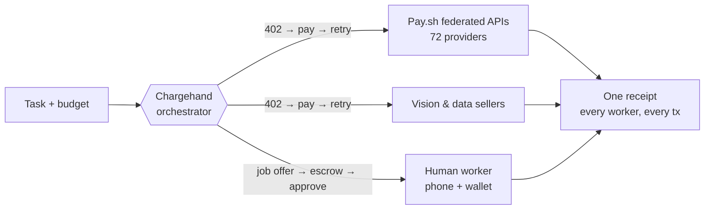

<div align="center">

# Chargehand

### The general contractor for AI agents

**Give an AI agent one USDC budget on Solana and it hires whoever's best for the job —<br>paid APIs, other agents, or human beings — with one receipt for the whole job.**

*One budget, any worker — human or machine.*

<br>


*Built in one night at **Cursor Miami: Ship Night** — Wynwood, August 6, 2026*

</div>

---

## The problem

AI can think, but it can't buy anything — and it definitely can't hire anyone.

Every tool an agent can reach was wired up in advance by a human who signed up, got an API key, and put a card on file. That's the ceiling on what agents can do: not intelligence, but **purchasing**. And when the best worker for a sub-task is a *person* — a photo, a fact-check, a judgment call — the agent has no way to hire them at all.

Banks don't issue accounts to software. Cards can't process a third of a cent. Chargehand fixes the layer above the payment rail: **the hiring.**

## What Chargehand does

The agent hands Chargehand a task and a budget cap. Chargehand:

1. **Decomposes** the task into sub-jobs
2. **Shops** a market of priced listings — machine *and* human — including **72 live providers federated from [Pay.sh](https://pay.sh)** (Solana Foundation × Google Cloud)
3. **Hires** the best worker for each piece via the x402 handshake — `HTTP 402 → pay USDC on Solana → retry with proof → receive work`
4. **Enforces the budget in code** — an over-priced seller is refused, not rationalized
5. **Holds deliverables in escrow** — payment releases only when the buyer approves the work
6. Returns the assembled result with **one receipt**: every worker, every payment

> Pay.sh built the catalog. Chargehand is the contractor that shops it.

## The demo

Ask it: **"How many people are at Ship Night right now?"** — budget $5.

| | Step | Worker | Paid |
|---|---|---|---|
| 1 | Identify the event → finds the Luma page, venue, doors | Exa Search *(via Pay.sh)* | $0.02 |
| 2 | Baseline → 250+ registered, capacity ~300 | Exa Search *(via Pay.sh)* | $0.02 |
| 3 | **Realizes no API on Earth can see inside a private venue** → hires a registered human worker; their phone buzzes; they shoot the room; photo held in escrow until the buyer approves | **Steven Luongo (human)** | **$1.50** |
| 4 | Refuses the $3.20 vision seller (**over budget — enforced in code**), hires the $0.40 one, counts heads | VisionCount | $0.40 |
| 5 | Synthesis → *"~187 people — 75% of registered still in the room"* | — | — |

**Receipt: $1.94 spent · $3.06 returned · 3 workers hired · 1 of them human.**

The room can audit the answer by looking around.

## Run it

```bash
npm install
npm run build
npm start        # production mode — use this on stage, never `npm run dev`
```

| Screen | URL | What it shows |
|---|---|---|
| **Big screen** | `http://localhost:3000` | Live market graph, reasoning console, budget bar, receipts, approval gate |
| **Worker phone** | `http://localhost:3000/worker` | Worker profile, wallet badge, job notifications, camera, instant payout |

Phone on another network? Tunnel it: `ngrok http 3000` and open the ngrok URL on the phone.

### Configuration (`.env.local` — all optional)

| Variable | Effect |
|---|---|
| `OPENAI_API_KEY` | Real head-count via a vision model (otherwise a plausible mock) |
| `MOCK_HEADCOUNT` | The mocked count — set it to your actual eyeball count |
| `AUTO_PHOTO_MS` | Failure insurance: auto-continue the human step after N ms |
| `NEXT_PUBLIC_WORKER_NAME` | The human worker's display name |

## Architecture



- **Next.js App Router** · all state in-memory · **SSE** event stream drives the graph, console, phone, and payouts in real time
- **Registry** federates a bundled snapshot of the live Pay.sh catalog + seeded sellers + registered human workers
- **Run engine**: scripted headline run + a generic path so any judge-typed task produces a real run
- Vision head-count is live when a key is present; deterministic otherwise — **the demo never depends on an LLM**

## What's real vs. simulated tonight

Routing, price selection, budget enforcement, the 402 job flow, the escrow/approval gate, and the Pay.sh federation are **real**. On-chain settlement is **simulated** (mock signatures) for the live demo; the full x402 V2 Solana settlement design — `exact` SVM scheme, sponsored fees, Circle devnet USDC — is specced and ready in [`BUILD_PLAN.md`](./BUILD_PLAN.md).

## Why this wins the category

Catalogs exist (Pay.sh, Coinbase's Bazaar, OpenDexter). Single-call routers exist (x402Scout). Humans-for-agents platforms exist — five of them, none on Solana. **Nobody runs one budget-governed job that hires APIs, agents, and human beings through the same handshake, with escrowed approval and one receipt.** That's the whitespace Chargehand claims — verified against every player above on the night this was built.

## Roadmap

- Real x402 V2 settlement on Solana mainnet (design complete in `BUILD_PLAN.md`)
- Reputation from transaction history · refund-on-rejection escrow
- Self-serve human worker onboarding — *anyone with a phone and a Solana address can earn from the agent economy*
- Budget policies as a standalone SDK

---

<div align="center">

*Agents will never get bank accounts. As of tonight, they don't need them — they can hire.*

**Chargehand** · built end-to-end in [Cursor](https://cursor.com) · powered by [Solana](https://solana.com), [Pay.sh](https://pay.sh) & USDC

</div>
